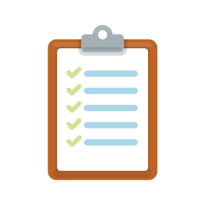
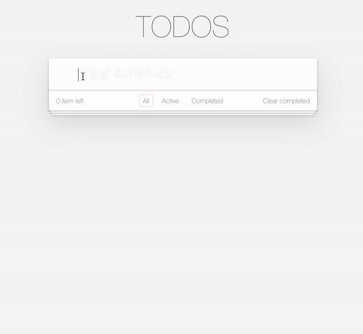

# 블랙커피 스터디 레벨1 (1주차)

## 1주차 미션 : TodoList CRUD

## 데모링크

[TODO-LIST-zel0rd-DEMO](http://zelord.tk:3003/)

### 요구사항
- [x] todo list에 todoItem을 키보드로 입력하여 추가하기
- [x] todo list의 체크박스를 클릭하여 complete 상태로 변경. (li tag 에 completed class 추가, input 태그에 checked 속성 추가)
- [x] todo list의 x버튼을 이용해서 해당 엘리먼트를 삭제
- [ ] todo list를 더블클릭했을 때 input 모드로 변경. (li tag 에 editing class 추가) 단 이때 수정을 완료하지 않은 상태에서 esc키를 누르면 수정되지 않은 채로 다시 view 모드로 복귀
- [x] todo list의 item갯수를 count한 갯수를 리스트의 하단에 보여주기
- [x] todo list의 상태값을 확인하여, 해야할 일과, 완료한 일을 클릭하면 해당 상태의 아이템만 보여주기
- [x] (심화)localStorage에 데이터를 저장하여, TodoItem의 CRUD를 반영하기. 따라서 새로고침하여도 저장된 데이터를 확인할 수 있어야 함

### 공부할 내용
- [ ] DOM
- [ ] BOM
- [ ] JavaScript Data Type
- [ ] 프론트엔드 상태관리
- [ ] EVENT


### 구조
- index.js에서 localStorageInit(), setEventAddCard(), setEventFilter()를 호출
    - localStorageInit()은 TODO/DONE key를 셋팅함
    - setEventAddCard()는 inputbox에서 enter 입력시 todo에 카드를 추가한다( 입력값이 공백일 때는 추가하지 않음, enter입력시 입력값 초기화)
    - setEventFilter()는 전체보기/해야할일/완료한일이 selected되었는지에 따라 동작할 이벤트를 걸어줌
-  index.js에서 위에 이벤트를 걸고나면 renderCard()를 호출하여 localStorage에서 값을 불러와 render를 수행함
- renderElement는 setEventFilter의 상태에 따라 크게 3가지로 나눠서 render를 수행 renderAll / renderActive / renderCompleted
    - renderAll은 renderActive와 renderCompleted를 수행
    - renderActive는 localStorage에서 TODO를 가져와 dom을 추가 함.
    - renderCompleted는 localStorage에서 DONE을 가져와 dom을 추가 함.
- 이렇게 render를 하고나면 setEventCheckBox / counter / setEventDeleteCard event를 등록함
    - setEventCheckBox는 체크박스가 클릭되면 클릭된 css를 적용하고 localStorage에서 위치도 바꿔줌
    - counter는 현재 Filter상태에 맞는 localStorage의 value의 길이를 출력해줌
    - setEventDeleteCard는 card에 hover했을 경우 x버튼이 나타나며, x버튼을 누르면 localStorage에서 삭제 후 다시 랜더


---------

<p align="middle" >
  
</p>
<h2 align="middle">JS 투두리스트 스텝1</h2>
<p align="middle">자바스크립트로 구현 하는 투두리스트</p>
<p align="middle">
  
  
  
  
  <a href="https://github.com/next-step/js-todo-list-step1/blob/main/LICENSE" target="_blank">
    
  </a>
</p>

# ☕️ 코드리뷰 모임 - Black Coffee
<br/>

> '훌륭한 의사소통은 블랙커피처럼 자극적이며, 후에 잠들기가 어렵다'. <br> A.M. 린드버그(미국의 작가, 수필가) -

<br/>

블랙커피처럼 서로를 자극해주고, 동기부여 해주며, 그 성장과정으로 인해 의미있는 가치를 만들어내고자 하는   
**프론트엔드 코드리뷰 모임** ☕️ **Black Coffee**입니다.

<br/>

## 🔥 Projects!

<p align="middle">
  
</p>

<p align="middle">
  <a href="https://next-step.github.io/js-todo-list-step1/">🖥️ 데모 링크</a>
</p>

<br/>

## 🎯 요구사항

- [ ] todo list에 todoItem을 키보드로 입력하여 추가하기
- [ ] todo list의 체크박스를 클릭하여 complete 상태로 변경 (li tag 에 completed class 추가, input 태그에 checked 속성 추가)
- [ ] todo list의 x버튼을 이용해서 해당 엘리먼트를 삭제
- [ ] todo list를 더블클릭했을 때 input 모드로 변경 (li tag 에 editing class 추가) 단 이때 수정을 완료하지 않은 상태에서 esc키를 누르면 수정되지 않은 채로 다시 view 모드로 복귀
- [ ] todo list의 item갯수를 count한 갯수를 리스트의 하단에 보여주기
- [ ] todo list의 상태값을 확인하여, 해야할 일과, 완료한 일을 클릭하면 해당 상태의 아이템만 보여주기

## 🎯🎯 심화 요구사항
- [ ] localStorage에 데이터를 저장하여, TodoItem의 CRUD를 반영하기. 따라서 새로고침하여도 저장된 데이터를 확인할 수 있어야 함

<br/>

## 🔔 참고사항
`TodoItem`을 추가할 시 아래 템플릿을 활용하면 됩니다.
```html
<ul id="todo-list" class="todo-list">
  <li>
    <div class="view">
      <input class="toggle" type="checkbox"/>
      <label class="label">새로운 타이틀</label>
      <button class="destroy"></button>
    </div>
    <input class="edit" value="새로운 타이틀" />
  </li>
  <li class="editing">
    <div class="view">
      <input class="toggle" type="checkbox" />
      <label class="label">완료된 타이틀</label>
      <button class="destroy"></button>
    </div>
    <input class="edit" value="완료된 타이틀" />
  </li>
  <li class="completed">
    <div class="view">
      <input class="toggle" type="checkbox" checked/>
      <label class="label">완료된 타이틀</label>
      <button class="destroy"></button>
    </div>
    <input class="edit" value="완료된 타이틀" />
  </li>
</ul>
```

<br/>

## ⚙️ Before Started

####  로컬에서 서버 띄워서 손쉽게 static resources 변경 및 확인하는 방법

로컬에서 웹서버를 띄워 html, css, js 등을 실시간으로 손쉽게 테스트해 볼 수 있습니다. 이를 위해서는 우선 npm이 설치되어 있어야 합니다. 구글에 `npm install` 이란 키워드로 각자의 운영체제에 맞게끔 npm을 설치해주세요. 이후 아래의 명령어를 통해 실시간으로 웹페이지를 테스트해볼 수 있습니다.

```
npm install -g live-server
```

실행은 아래의 커맨드로 할 수 있습니다.

```
live-server 폴더명
```

<br/>

## 💻 Code Review
아래 링크들에 있는 리뷰 가이드를 보고, 좋은 코드 리뷰 문화를 만들어 나가려고 합니다.  
- [코드리뷰 가이드1](https://edykim.com/ko/post/code-review-guide/)
- [코드리뷰 가이드2](https://wiki.lucashan.space/code-review/01.intro.html#_1-code%EB%A5%BC-%EB%A6%AC%EB%B7%B0%ED%95%98%EB%8A%94-%EC%82%AC%EB%9E%8C%EB%93%A4%EC%9D%80-%EC%96%B4%EB%96%A4%EA%B2%83%EC%9D%84-%EC%A4%91%EC%A0%90%EC%A0%81%EC%9C%BC%EB%A1%9C-%EC%82%B4%ED%8E%B4%EC%95%BC%ED%95%98%EB%8A%94%EA%B0%80)

<br/>

## 💬 1주차 미션 후기 블로그

아래 링크는 1주차 미션을 진행하면서 블로그를 작성해주신 분들의 글입니다. 미션을 진행하면서, 다른 분들의 문제 해결 과정이 궁금하다면 참고해주세요 😄
- [1주차 미션후기](https://www.notion.so/1-2-8b624729fbce4174b8b583efb10c3200)
- [블랙커피 프론트엔드 스터디 레벨1 후기](https://yujo11.github.io/%EB%B8%94%EB%9E%99%EC%BB%A4%ED%94%BC/%EB%B8%94%EB%9E%99%EC%BB%A4%ED%94%BC-%ED%94%84%EB%A1%A0%ED%8A%B8%EC%97%94%EB%93%9C-%EC%8A%A4%ED%84%B0%EB%94%94-%EB%A0%88%EB%B2%A81-%ED%9B%84%EA%B8%B0/)

<br/>

## 👏🏼 Contributing

만약 미션 수행 중에 개선사항이 필요하다면, 언제든 자유롭게 PR을 보내주세요.

<br/>

## 🐞 Bug Report

버그를 발견한다면, [Issues](https://github.com/next-step/js-todo-list-step1/issues)에 등록해주세요.

<br/>

## 📝 License

This project is [MIT](https://github.com/next-step/js-todo-list-step1/blob/main/LICENSE) licensed.
